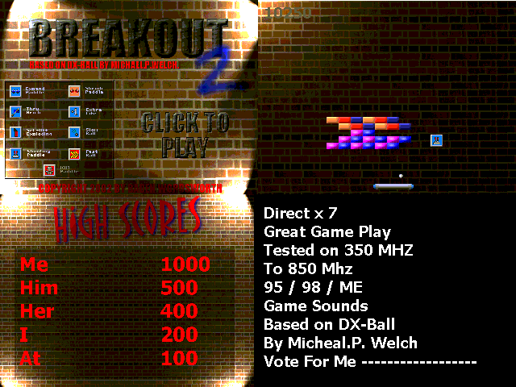

<div align="center">

## DX BALL Best one Yet


</div>

### Description

Breakout Clone / Dx - Ball / Arconoid

This Is A Project I Started on For Cert 4 Information Technology I Am Still Working on Documentation And will Update Soon.

THIS IS BETA RELEASE...

Based On Dx-Ball By Micheal.P.Welch. and Used Basic Dx Engine By Jason Shimkoski...

Please Vote For Me And I Will Keep Submiting My Projects. (hmm sounds like a bribe) :) but its not.. just would like to know if people are interested...

Thanks Baden Wordsworth..

http://home.austarnet.com.au/changeoflife

For download

zip size 1.18 mg..

It is to big for PSC.

http://home.austarnet.com.au/changeoflife
 
### More Info
 
Download

http://home.austarnet.com.au/changeoflife


<span>             |<span>
---                |---
**Submitted On**   |
**By**             |[Baden Wordsworth](https://github.com/Planet-Source-Code/PSCIndex/blob/master/ByAuthor/baden-wordsworth.md)
**Level**          |Intermediate
**User Rating**    |4.8 (48 globes from 10 users)
**Compatibility**  |VB 5\.0, VB 6\.0
**Category**       |[Games](https://github.com/Planet-Source-Code/PSCIndex/blob/master/ByCategory/games__1-38.md)
**World**          |[Visual Basic](https://github.com/Planet-Source-Code/PSCIndex/blob/master/ByWorld/visual-basic.md)
**Archive File**   |[](https://github.com/Planet-Source-Code/baden-wordsworth-dx-ball-best-one-yet__1-37999/archive/master.zip)


### Source Code

```
http://home.austarnet.com.au/changeoflife
For download
zip size 1.18 mg..
```

